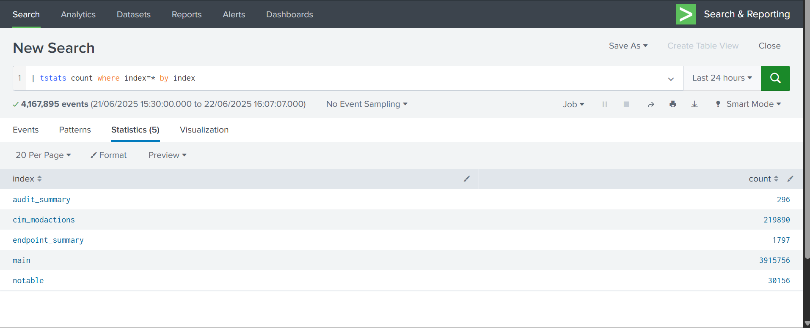
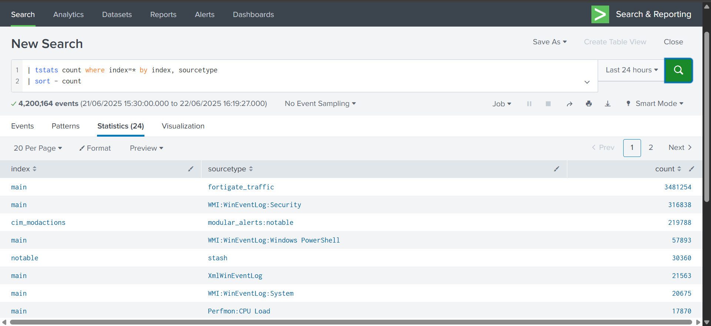
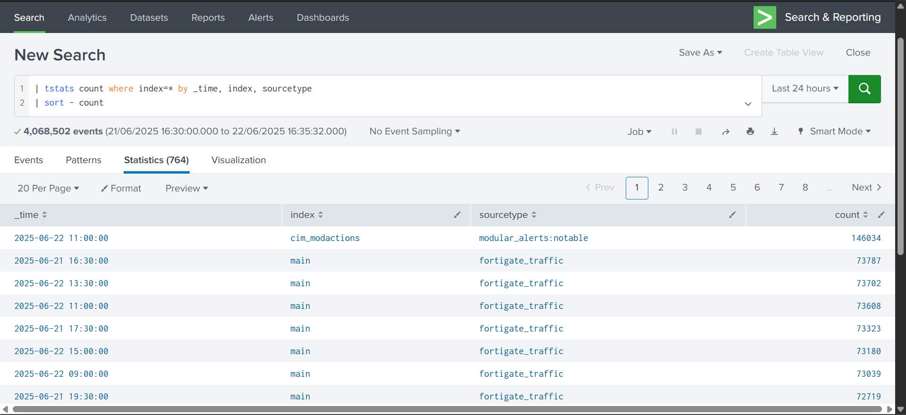
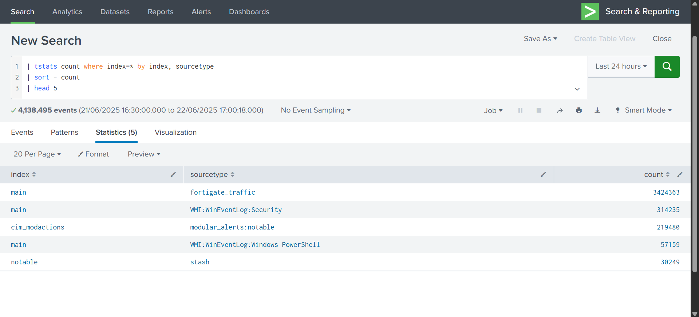
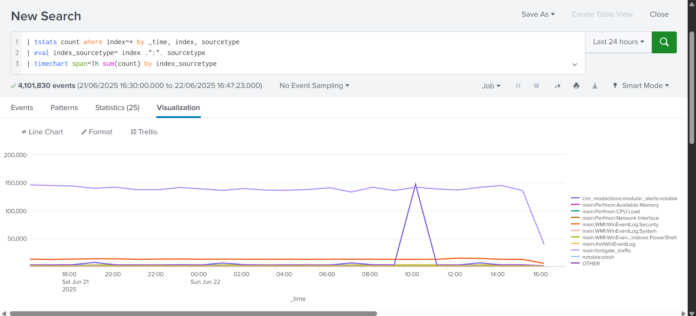

# 📊 Active Index Discovery (Log Source Inventory)

## 🛡️ Objective

This project helps identify and visualize **active log sources (indexes and sourcetypes)** inside a Splunk environment. This task is usually the first step for a SOC Analyst to:
- Confirm which logs are coming in
- Check for missing logs
- See what kind of data is available for detection

---

## 🛠 Tools & Lab Setup

| Tool | Description |
|------|-------------|
| Splunk Enterprise | SIEM platform for log analysis |
| Search & Reporting App | Used to run SPL queries |
| Data Sources | Fortinet, Windows Event Logs, Linux Logs, CrowdStrike |
| Time Range | Last 24 hours |

---

## 📁 Files Included

| File | Description |
|------|-------------|
| `project1_spl_commands.txt` | All SPL queries used in this project |
| `project1_index_table.png` | Screenshot showing list of indexes |
| `project1_index_sourcetype_table.png` | Screenshot showing index + sourcetype combination |
| `project1_index_sourcetype_sorted.png` | Screenshot showing sorted log types |
| `project1_top5_sources.png` | Top 5 most active log sources |
| `project1_index_sourcetype_timechart.png` | Chart showing log trends over time |

---

## 🧠 SPL Queries and Explanation

### 1️⃣ List All Active Indexes

```spl
| tstats count where index=* by index
````

✔️ Shows all indexes that are receiving logs.

---

### 2️⃣ List All Active Index + Sourcetype Pairs

```spl
| tstats count where index=* by index, sourcetype 
| sort - count
```

✔️ Gives event counts by sourcetype inside each index.   
✔️ Helps identify which types of logs are being collected.

---

### 3️⃣ Include Timestamps with Logs

```spl
| tstats count where index=* by _time, index, sourcetype 
| sort - count
```

✔️ Adds time dimension to log analysis.   
✔️ Useful for seeing log flow minute by minute.

---

### 4️⃣ Find Top 5 Noisiest Log Sources

```spl
| tstats count where index=* by index, sourcetype 
| sort - count 
| head 5
```

✔️ Quickly shows the most active log types.

---

### 5️⃣ Timechart View of Log Sources

```spl
| tstats count where index=* by _time, index, sourcetype
| eval index_sourcetype = index . ":" . sourcetype
| timechart span=1h sum(count) by index_sourcetype
```

✔️ Shows log trends over time.  
✔️ `eval` is used to combine index and sourcetype into one label like `main:WinEventLog`.   
✔️ `.` is the **concatenation operator** in SPL (it joins strings).   

---

## 📸 Screenshots

### ✅ Index Count Table



---

### ✅ Index + Sourcetype Table



---

### ✅ Sorted Log Sources



---

### ✅ Top 5 Log Sources



---

### ✅ Timechart of Log Trends



---

## 🎯 SOC Analyst Use Cases

* ✅ Ensure log sources are connected
* ✅ Identify missing or delayed logs
* ✅ Prioritize detection use cases based on log availability
* ✅ Tune noisy sources that generate too much data

---

## ✍️ Author

**Rahul Krishna R**  
Defensive Security Practitioner | Hands-on with SOC, Threat Detection & Cryptography  
This project is part of my practical cybersecurity portfolio, built to simulate real-world SOC use cases using Splunk.

---


